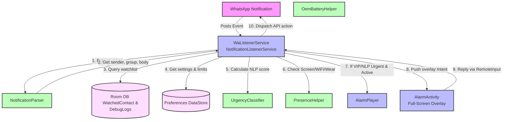
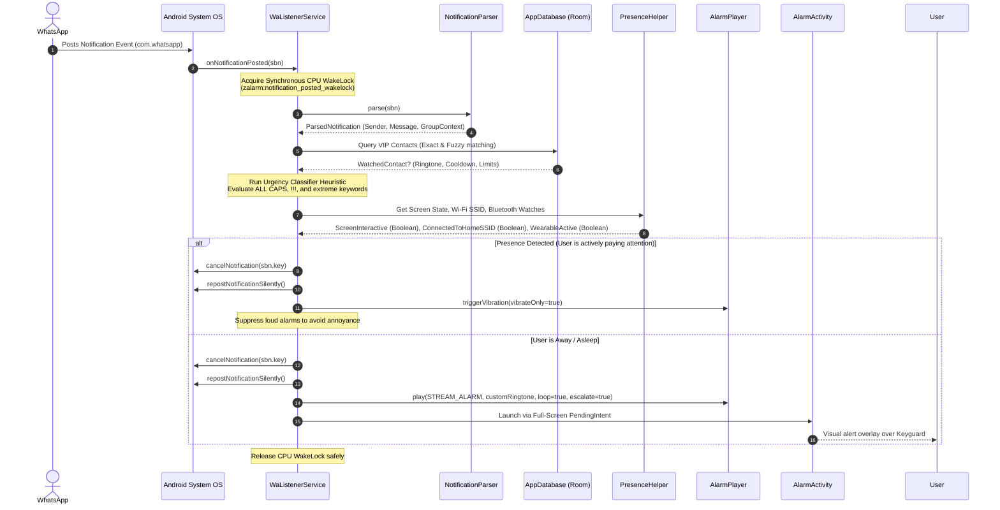
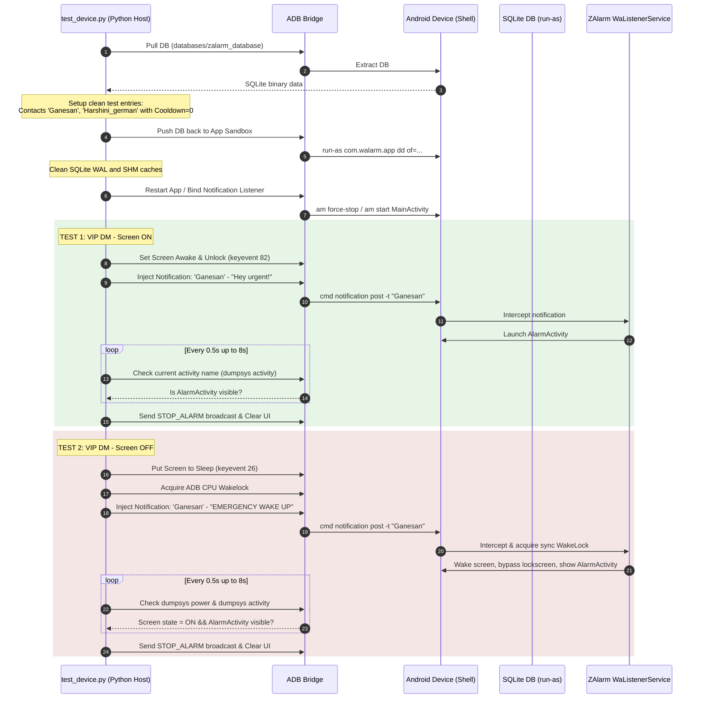

# 🚨 ZAlarm: WhatsApp Priority Alarm App

[](https://developer.android.com)
[](https://gradle.org)
[](test_device.py)
[](#)

ZAlarm is a research-backed, native Android background service designed to solve critical notification failures on modern OEM devices. Operating at the low-level **Notification Intercept Layer**, ZAlarm bypasses buggy per-app notification channel overrides, OEM battery-saver suspensions, and Do Not Disturb (DND) configurations. It guarantees that emergency messages from priority contacts or urgent keywords trigger a full-volume, looping alarm using `STREAM_ALARM`, ensuring you never miss a life-critical WhatsApp call or message.

---

## 📖 Table of Contents
- [✨ Core Features](#-core-features)
- [🧩 Architecture & System Design](#-architecture--system-design)
  - [1. System Components & Data Flow (High-Level)](#1-system-components--data-flow-high-level)
  - [2. Notification Processing Sequence (Low-Level)](#2-notification-processing-sequence-low-level)
  - [3. ADB E2E Testing Harness Workflow](#3-adb-e2e-testing-harness-workflow)
- [🛠️ Deep-Dive into Advanced Mechanisms](#%EF%B8%8F-deep-dive-into-advanced-mechanisms)
  - [Urgency NLP Scoring Heuristic](#urgency-nlp-scoring-heuristic)
  - [Smart Presence-Aware Suppression](#smart-presence-aware-suppression)
  - [OEM Battery Exemption Wizard](#oem-battery-exemption-wizard)
- [📂 Directory & File Structure](#-directory--file-structure)
- [🚀 Setup & Installation](#-setup--installation)
- [🧪 Testing & E2E Validation](#-testing--e2e-validation)

---

## ✨ Core Features

| Feature | Description | Implementation Details |
| :--- | :--- | :--- |
| **🚨 Alarm Stream Override** | Bypasses silent and notification volumes, forcing alarms through `STREAM_ALARM`. | Uses Android's `MediaPlayer` and `AudioManager` to hijack audio routing. |
| **🧠 Urgency NLP scoring** | Evaluates message content in real time to score urgency (0–100) and trigger alarms for emergencies. | Dynamic lexical analysis scoring keywords, capitalization, and punctuation. |
| **🛡️ Smart Presence Suppression** | Suppresses loud audio alarms if the user is already active or paying attention. | Dynamically checks: Screen active, connected to home Wi-Fi SSID, or Smartwatch connected. |
| **⏳ Multi-Tier Matching** | Matches exact or fuzzy contact names, group names, or individual group members. | Leverages Room Database query levels with SQL `LIKE` constraints. |
| **🔁 Repeat & Escalate** | Loops the alarm audio and progressively increases volume until manually dismissed. | Custom volume handler using an escalating background handler thread. |
| **📱 Full-Screen Heads-up UI** | Displays a full-screen overlay over the lock screen with dismiss controls and custom actions. | Implements `USE_FULL_SCREEN_INTENT` with keyguard bypass flags. |
| **💬 Bidirectional Quick Reply** | Allows immediate replies directly from the alarm overlay. | Invokes the Android `RemoteInput` binder system directly back into WhatsApp. |
| **🔋 Bulletproof Resilience** | Keeps background listener alive under aggressive OEM memory managers. | Combines a Foreground Service, boot receivers, and WorkManager periodic self-healers. |

---

## 🧩 Architecture & System Design

### 1. System Components & Data Flow (High-Level)

This diagram shows how external WhatsApp notifications flow through ZAlarm's internal subsystems and evaluate database rules before determining whether to suppress the alarm or launch the Full-Screen UI.



---

### 2. Notification Processing Sequence (Low-Level)

This sequence diagram explains the execution flow from the moment an Android system notification is posted down to the validation, presence checks, and alarm routing.



---

### 3. ADB E2E Testing Harness Workflow

This diagram demonstrates how the automated python testing suite (`test_device.py`) interfaces with ADB, locks the screen, manipulates the SQLite database on the device, injects test notifications, and uses a reliable polling routine to verify complete E2E system behavior.



---

## 🛠️ Deep-Dive into Advanced Mechanisms

### Urgency NLP Scoring Heuristic
If enabled in settings, ZAlarm analyzes incoming text notifications offline to compute an urgency score from `0` to `100`. If this score meets or exceeds the user-configured threshold (default: `50`), the notification triggers an emergency alarm, even if the sender is not on the VIP watchlist.

The scoring heuristic (`UrgencyClassifier.kt`) scales as follows:
*   **Extreme Keywords (+40 pts)**: `accident`, `hospital`, `emergency`, `dying`, `police`, `heart attack`, `icu`, `ambulance`.
*   **High Keywords (+25 pts)**: `urgent`, `come quick`, `help`, `danger`, `fire`, `bleeding`, `broken bone`, `call me now`, `where are you`.
*   **Medium Keywords (+15 pts)**: `please call`, `lost`, `stolen`, `hurt`, `asap`, `quickly`.
*   **Punctuation Signals**: Multiple exclamation marks (`!!!`) add **+15 pts**; a single mark adds **+5 pts**.
*   **Case Intensity (+15 pts)**: Triggers if the message contains four or more alphabetic letters and is written entirely in **ALL CAPS**.
*   **Presence Verification (+15 pts)**: Looks for localized checking statements like `are you ok`, `are you safe`, `where r u`.

---

### Smart Presence-Aware Suppression
Traditional priority filters repeatedly trigger annoying alarms even when you are staring at your phone or typing on your smartwatch. ZAlarm checks three separate sensor metrics through `PresenceHelper.kt` before playing sound:

1.  **Screen-On State**: Uses `PowerManager.isInteractive` to see if the device screen is currently active and in use.
2.  **Home Wi-Fi BSSID**: Inspects `WifiManager.connectionInfo.ssid`. If it matches the user's configured Home Network SSID, it assumes proximity to active household nodes and downgrades the alert.
3.  **Smartwatch Connectivity**: Queries the local `BluetoothAdapter` bonded devices. If a smartwatch profile (matching standard wear, gear, watch, fit, galaxy, or amazfit keywords) is paired, it leverages that presence vector to suppress the audio stream in favor of subtle vibrations.

---

### OEM Battery Exemption Wizard
Modern Android forks (Xiaomi MIUI, OnePlus OxygenOS, Oppo ColorOS, Huawei EMUI, Samsung OneUI) employ aggressive out-of-memory (OOM) managers that silently kill background processes, including bound `NotificationListenerServices`. 

ZAlarm solves this by detecting the manufacturer at runtime via `OemBatteryHelper.kt` and deep-linking the user directly to the system-specific autostart or protected-app settings screen, eliminating manual settings navigation:

*   **Xiaomi/Redmi/Poco**: Redirects to `com.miui.securitycenter` autostart manager.
*   **Oppo/Realme**: Redirects to `com.coloros.safecenter` startup application list.
*   **Vivo/iQOO**: Redirects to `BgStartUpManagerActivity` or background consumption managers.
*   **Huawei**: Redirects to App Launch `ProtectActivity` parameters.

---

## 📂 Directory & File Structure

Here is a map of ZAlarm's modular native codebase:

```text
app/src/main/
├── AndroidManifest.xml          <-- Permission definitions, intent-filters, service exports
├── java/com/walarm/app/
│   ├── alarm/
│   │   └── AlarmPlayer.kt        <-- MediaPlayer audio loops, volume scaling, stream overrides
│   ├── data/
│   │   ├── AppDatabase.kt        <-- Main Room DB SQLite generator
│   │   ├── WatchedContact.kt     <-- Watchlist item Schema (Schedules, Keywords, Cooldowns)
│   │   ├── ContactDao.kt         <-- Contact fetchers, fuzzy lookups, and state update triggers
│   │   ├── DebugLog.kt           <-- Real-time notification intercept logging schema
│   │   └── DebugLogDao.kt        <-- Intercept log manager for UI debugging
│   ├── service/
│   │   ├── WaListenerService.kt  <-- NotificationListener implementation, routing engine, WakeLocks
│   │   ├── ServiceRestartWorker. <-- WorkManager periodic guardian task (keeps service running)
│   │   ├── BootReceiver.kt       <-- Re-registers listeners immediately on system boot
│   │   ├── PhoneCallReceiver.kt  <-- Mutes alerts if an active GSM voice call is ongoing
│   │   └── StopAlarmReceiver.kt  <-- Receiver to handle quick-action "STOP ALARM" notifications
│   ├── ui/
│   │   ├── MainActivity.kt       <-- App Compose entry point
│   │   ├── WatchlistScreen.kt    <-- Compose interface to manage VIP contacts, limits, schedules
│   │   ├── OnboardingScreen.kt   <-- Permission workflow helper
│   │   ├── DebugLogsScreen.kt    <-- Viewer for real-time parsed logs
│   │   ├── GlobalSettingsScreen. <-- Preferences panel (NLP, Wi-Fi ssid, smartwatch switches)
│   │   └── AlarmActivity.kt      <-- Full-screen overlay activity drawing over lockscreen
│   └── util/
│       ├── NotificationParser.kt <-- Intercept extractor (Differentiates DMs, Group, and Senders)
│       ├── UrgencyClassifier.kt  <-- Local heuristic rule-based urgency analyzer
│       ├── OemBatteryHelper.kt   <-- Target OEM battery-saver redirection links
│       └── PresenceHelper.kt     <-- Bluetooth paired wear, screen interaction, and wifi SSID check
└── res/                          <-- Layout resources, icons, XML profiles
```

---

## 🚀 Setup & Installation

### 1. Build and Sideload the APK
You can compile and build the release binary from the root folder or sideload the precompiled bundle:
```bash
# Build the application release package using gradle wrapper
./gradlew assembleDebug

# Install target package onto your connected device
adb install app/build/outputs/apk/debug/app-debug.apk
```
*Note: A precompiled `Z_Alarm.apk` is also available in the root directory for immediate local sideloading.*

### 2. Grant Mandatory System Permissions
For ZAlarm to operate reliably in the background, you must configure the following device permissions:
1.  **Notification Access**: Settings ➜ Apps ➜ Special App Access ➜ Notification Access ➜ Toggle **ZAlarm** to ON.
2.  **Display Over Other Apps**: Settings ➜ Apps ➜ Special App Access ➜ Draw Over Other Apps ➜ Allow **ZAlarm**.
3.  **Battery Optimization Exemption**: Open ZAlarm, tap the Battery Settings Warning banner, and select **No Restrictions** (autostart allowed).

---

## 🧪 Testing & E2E Validation

ZAlarm includes a professional automated Python integration test suite located at `test_device.py`. It uses ADB notification posting utilities combined with programmatic SQLite injection to validate alarm triggers under varying power states.

### Running the Integration Tests

1.  Connect your Android device via USB and ensure ADB debugging is enabled.
2.  Verify the ZAlarm application is installed and active on the device.
3.  Execute the automated test script:
```bash
# Set execute permissions
chmod +x test_device.py

# Run the integration test suite
python3 test_device.py
```

### What the test suite validates:
1.  **VIP DM - Screen ON**: Confirms that a priority contact message posted while using the device pops up the full-screen overlay and sounds the alert stream.
2.  **VIP DM - Screen OFF**: Puts the screen to sleep, simulates an incoming high-priority notification, and verifies that the CPU is kept awake, the screen wakes up, and the overlay successfully draws over the keyguard.
3.  **Group VIP - Screen OFF**: Verifies that messages sent to monitored groups trigger correctly while the phone is locked.
4.  **Non-VIP Ignores**: Simulates messages from spam or unmonitored senders and guarantees no audible alarm triggers.
