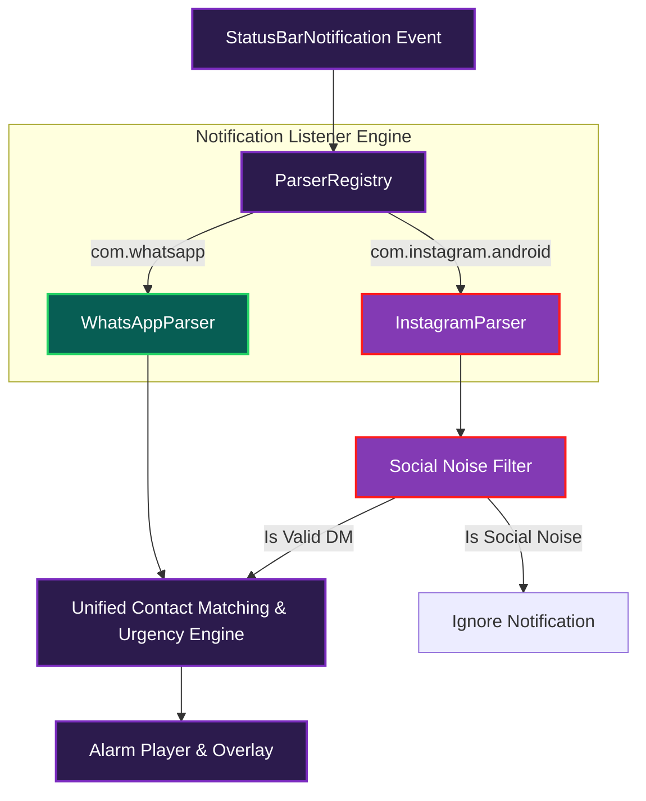

# 📜 ZAlarm Multi-Platform Evolution: Instagram Architecture & Strategy

> **"To escalate a notification to an emergency alarm is to claim absolute dominance over the human sensorium. When a WhatsApp message rings, it is an imperative from a peer. If an Instagram notification rings because someone liked a picture of your dinner, the system has betrayed its purpose."**

---

## 🏛️ Executive Summary & Philosophical Foundations

ZAlarm was initially engineered around a fundamental premise: **WhatsApp is a high-intent, direct interpersonal communication vector.** Incoming notifications are almost exclusively real-time phone-contact conversations or active group chats.

Expanding ZAlarm to support **Instagram (`com.instagram.android`, `com.instagram.lite`)** introduces a profound architectural and philosophical shift:

### The Signal-to-Noise Ratio (SNR) Paradox
1. **WhatsApp Ecosystem**: High signal, low ambient noise. 95%+ of notifications are direct text or call attempts.
2. **Instagram Ecosystem**: Mixed signal, extreme ambient noise. Instagram is designed as an attention-economy engagement loop. A user receives Direct Messages (DMs), Story replies, Group DMs, alongside Likes, Comments, Story Views, Tagged Photos, Broadcast Channel blasts, Reel mentions, Live Video alerts, and Growth pushes ("UserX shared a post").

### Philosophical Imperative: Intent-Based Interception
If ZAlarm indiscriminately alarms on every Instagram notification, it transforms from a **life-saving priority alarm** into a **nuisance alarm**. Therefore, evolving ZAlarm to Instagram demands a transition from **Package-Based Interception** to **Intent-Based Semantic Interception**. The app must discern with 100% precision: **Is this an urgent communication attempt from a human being, or social network ambient noise?**

---

## 🔍 Technical Research & Risky Parts Analysis

### 1. Package Identifiers & App Variants
| App Variant | Package Name | Target Use Case |
| :--- | :--- | :--- |
| **Instagram Main** | `com.instagram.android` | Full native client (Primary target) |
| **Instagram Lite** | `com.instagram.lite` | Lightweight web-view wrapper used in emerging markets |
| **Threads (Optional)** | `com.instagram.barcelona` | Text-based companion app |

### 2. Notification Structure & Payload Comparison

| Notification Feature | WhatsApp (`com.whatsapp`) | Instagram (`com.instagram.android`) | Architectural Risk / Mitigation |
| :--- | :--- | :--- | :--- |
| **Conversation Style** | `Notification.MessagingStyle` across all versions. | Uses `MessagingStyle` for DMs; simple `BigTextStyle` for social alerts. | **Mitigation**: Require `MessagingStyle` or strict DM title/text structure for Instagram parsing. |
| **Direct Reply (`RemoteInput`)** | Consistent `RemoteInput` action across DM notifications. | Present on DMs, but action key indexing can vary between versions. | **Mitigation**: Dynamically scan `notification.actions` for non-null `remoteInputs` instead of hardcoded index. |
| **Call Notifications** | `CATEGORY_CALL` + specific text patterns ("Voice call...", "Video call..."). | `CATEGORY_CALL` or title containing "Incoming call...", "is calling...". | **Mitigation**: Add platform-specific call detection strings to call override filter. |
| **Social Noise Alerts** | Minimal. | Massive ("liked your photo", "commented on", "started live", "tagged you"). | **Mitigation**: Implement mandatory social noise heuristic filter (`InstagramParser`). |
| **Android 11+ Package Visibility** | Requires `<package android:name="com.whatsapp" />` in `<queries>`. | Requires `<package android:name="com.instagram.android" />` in `<queries>`. | **Mitigation**: Declare Instagram package names in `AndroidManifest.xml`. |

### 3. Key Technical Risks & Mitigations

#### Risk A: False Alarms from Social Engagement Noise
* **Problem**: Instagram sends push notifications for likes, comments, reels, story views, and broadcast channels. Alarming on these destroys user experience.
* **Mitigation**: Implement `InstagramParser` with an aggressive DM validation step:
  - Verify presence of `MessagingStyle` sender/messages.
  - Reject notifications containing social noise keywords (`liked`, `commented`, `started a live`, `reels`, `mentioned you in a story`, `broadcast channel`, `sent a reel`).

#### Risk B: Android 11+ Package Visibility Blocking Quick Reply Launch
* **Problem**: `packageManager.getLaunchIntentForPackage("com.instagram.android")` will silently return `null` if `<queries>` is missing in `AndroidManifest.xml`.
* **Mitigation**: Explicitly register `com.instagram.android` and `com.instagram.lite` inside `<queries>`.

#### Risk C: High Notification Volume & Battery / WakeLock Strain
* **Problem**: Instagram generates more ambient notifications than WhatsApp. Running heavy regex on main thread or holding WakeLocks too long will cause battery drain or OS service kills.
* **Mitigation**: Fast-path rejection before WakeLock acquisition—if package is Instagram, check if string contains obvious noise before launching coroutines.

---

## 🏗️ Unified Multi-App Architecture Blueprint

---

## 🗺️ Phased Implementation Roadmap

### 🎯 Phase 1: Core Multi-App Architecture & Instagram Parser Engine *(COMPLETED)*
- Refactor notification parsing into pluggable `AppNotificationParser` interface.
- Implement `WhatsAppParser` and `InstagramParser`.
- Add Instagram social noise detection algorithm (filtering likes, comments, live streams, reels).
- Register `ParserRegistry` supporting `com.whatsapp`, `com.whatsapp.w4b`, `com.instagram.android`, `com.instagram.lite`, `com.android.shell`.
- Update `AndroidManifest.xml` with `<queries>` for Instagram packages.
- Add Instagram support toggles in `AppSettings` (`enableInstagram`, `overrideInstagramCalls`).
- Write comprehensive unit tests for `InstagramParser` validating DM detection vs noise rejection.

### 🎨 Phase 2: App-Aware UI & Multi-App Contact Watchlist *(COMPLETED)*
- Extend `WatchedContact` Room database schema with `targetApp` field (`ALL`, `WHATSAPP`, `INSTAGRAM`).
- Update Jetpack Compose Watchlist & Settings screens with platform toggles and app icons.
- Support app-specific contact filtering and search.

### 🔊 Phase 3: Instagram Call Escalation & Presence Integration *(COMPLETED)*
- Add dedicated Instagram Call detection logic for `CATEGORY_CALL` and incoming audio/video calls.
- Integrate `PresenceHelper` and `UrgencyClassifier` for Instagram DMs.

### 🧪 Phase 4: E2E ADB Harness Expansion & Device Validation *(COMPLETED)*
- Extend `test_device.py` ADB automation script to test Instagram direct message triggers, call escalation, lockscreen wakeups, and noise rejection.
- Expanded unit test suite (`InstagramDmClassifierTest`, `InstagramParserTest`) covering all classification edge cases.

---
